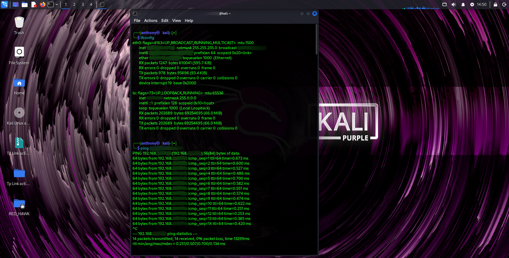
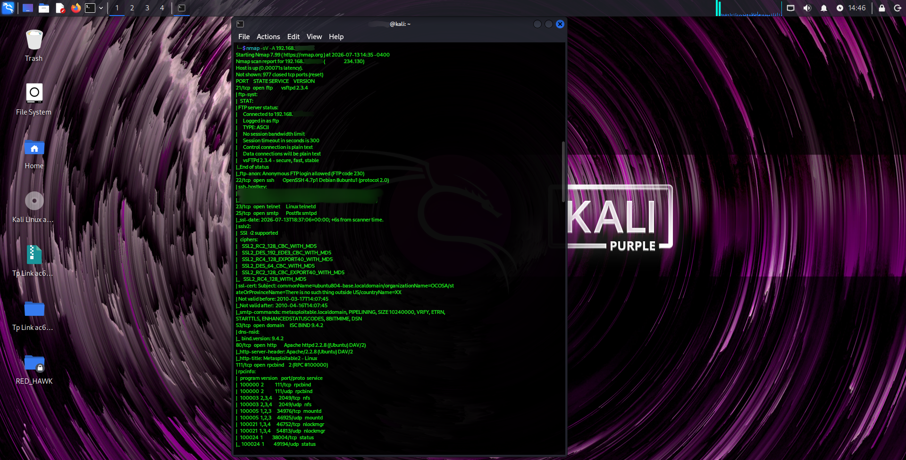
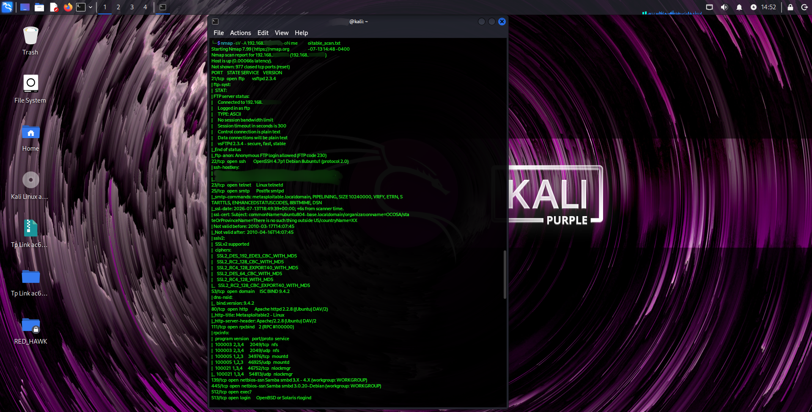
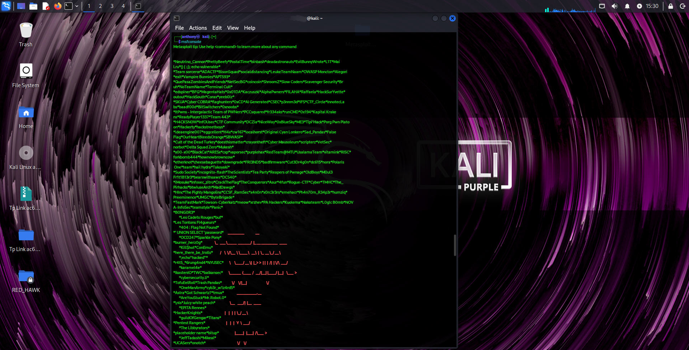
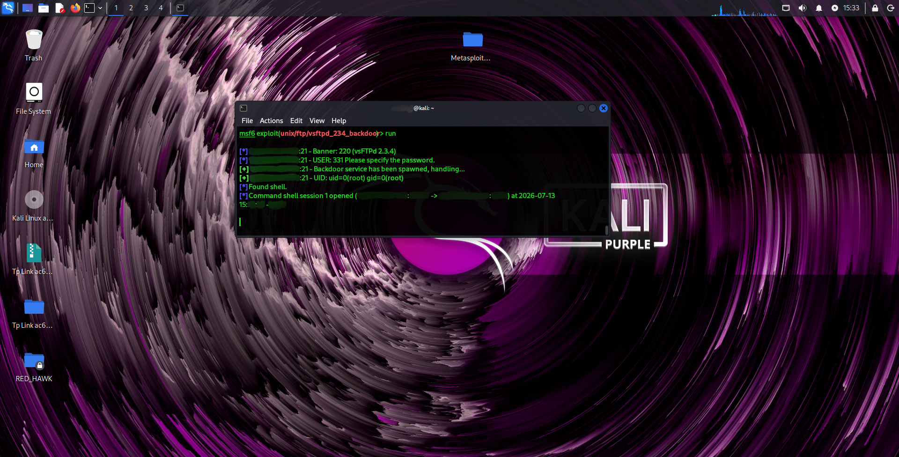
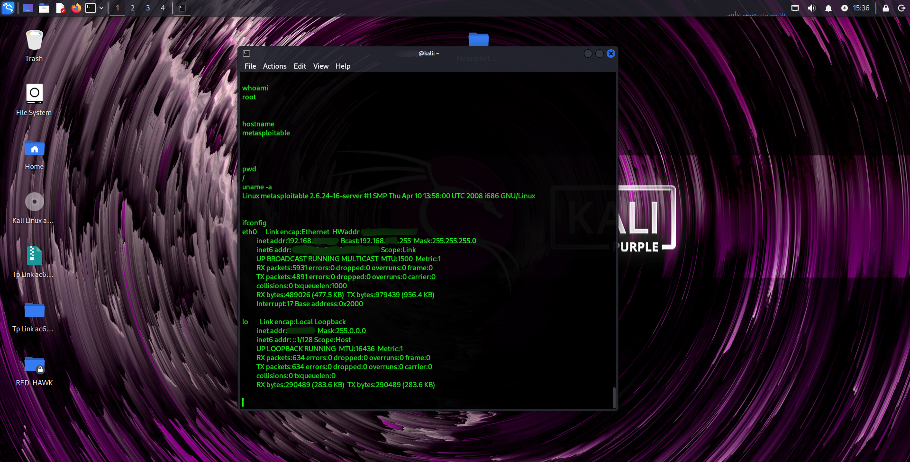
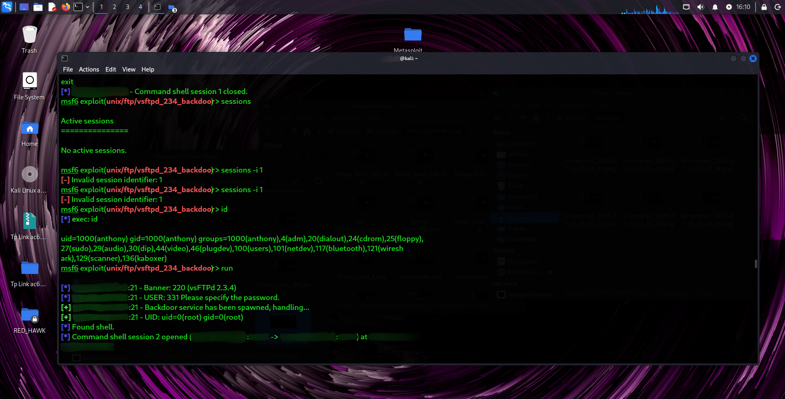
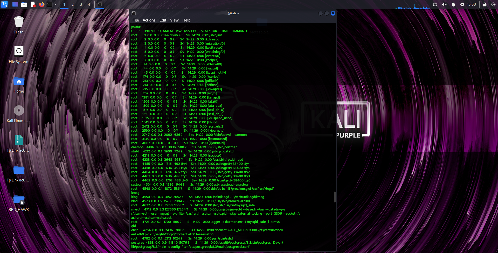
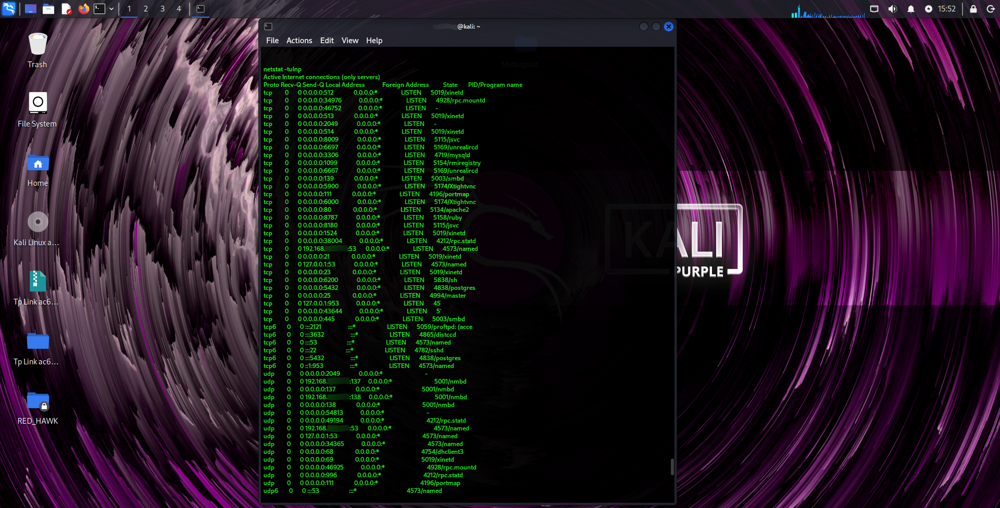
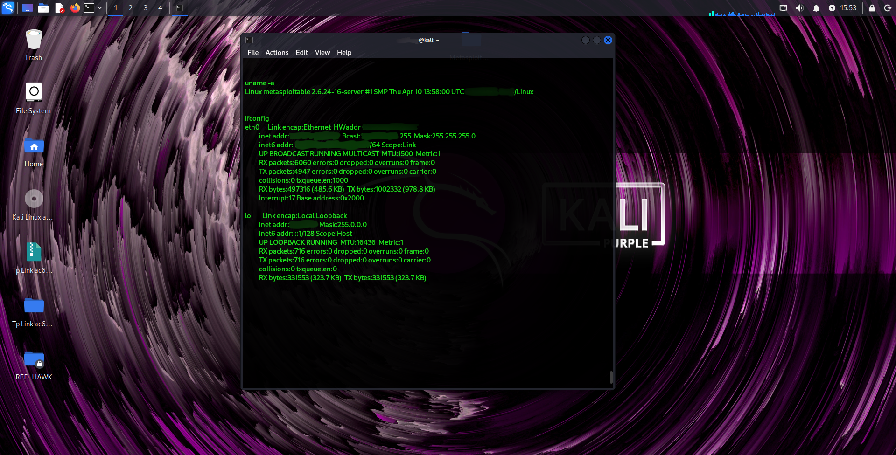

# Metasploit Framework Lab

## Project Overview
This project demonstrates a penetration testing lab using Kali Linux and Metasploitable 2 in a controlled environment. The objective was to identify vulnerabilities, exploit the target, and perform post-exploitation enumeration for learning purposes only.

> *Disclaimer:* This project was performed in a controlled lab environment for educational and authorized testing only.

---

## Lab Environment

- Attacker Machine: Kali Linux
- Target Machine: Metasploitable 2
- Virtualization: VMware Workstation
- Network: Host-Only
- Host OS: Windows 11

---

## Tools Used

- VMware Workstation Player 16
- Nmap
- Metasploit Framework
- Linux Terminal

---

## Project Workflow

1. Verify network connectivity
2. Perform Nmap scan
3. Identify vulnerable service
4. Launch Metasploit Framework
5. Search exploit module
6. Configure RHOST and required options
7. Exploit the target
8. Verify Meterpreter session
9. Perform post-exploitation enumeration
10. Collect evidence

---

## Skills Demonstrated

- Network Scanning
- Vulnerability Identification
- Metasploit Framework
- Exploitation
- Meterpreter
- Linux Commands
- Post-Exploitation
- Enumeration

---

## Evidence

## Evidence

### 01. Metasploit Loggedin

### 02. Kali IP & Ping Success

### 03. Nmap Scan

### 04. Nmap Scan (A)
.png)

### 05. Nmap Scan (B)
.png)

### 06. Nmap Scan 2

### 07. Nmap Scan 2 (A)
.png)

### 08. Nmap Scan 2 (B)
.png)

### 09. MSFConsole

### 10. MSFConsole (A)
.png)

### 11. Module Search & RHOST Configuration

### 12. Exploit

### 13. Root Verification

### 14. Session Management

### 15. Session Management (A)
.png)

### 16. Enumeration 1

### 17. Enumeration 1 (A)
.png)

### 18. Enumeration 1 (B)
.png)

### 19. Enumeration 2

### 20. Enumeration 3 & Ifconfig

---

## Result

Successfully exploited the vulnerable machine in a controlled lab environment and performed post-exploitation enumeration.

---

## Author

*Chandranil Sawant*

GitHub: https://github.com/chandranil-sawant-tech
